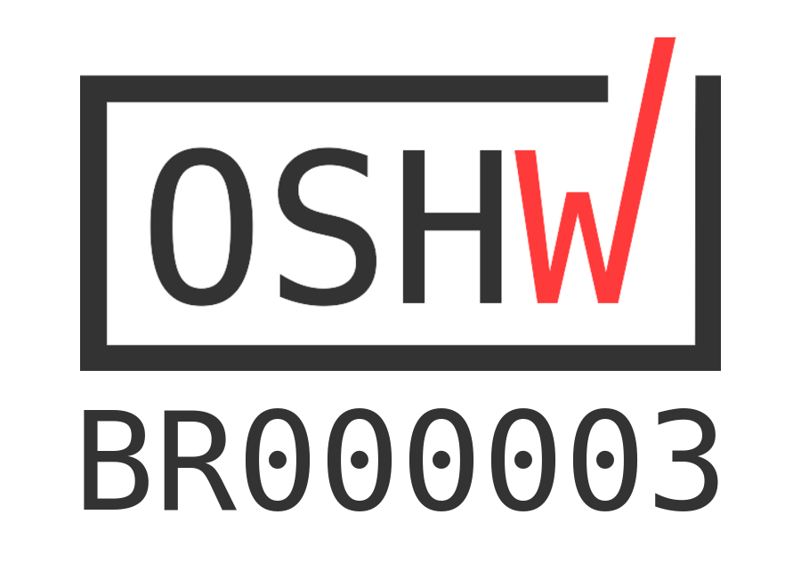

# Placa Franzininho DIY

Para mais detalhes sobre o projeto, montagem e programação, acesse a [documentação](https://franzininho.gitbook.io/franzininho-docs/)

O projeto é open hardware e foi publicado em [CC-BY-SA-4.0](https://github.com/Franzininho/franzininho-diy-board/blob/main/LICENSE)

A Franzininho DIY está certificada na [OSHWA com UID BR000003](https://certification.oshwa.org/br000003.html)

Entenda mais sobre open hardware: [Open source hardware: Conheça a definição e as boas práticas](https://www.embarcados.com.br/open-hardware-definicao/)

# Características da Franzininho DIY

- Placa em face simples - Para facilitar a fabricação caseira;
- Componentes em PTH - Para montagem manual pois esse é um dos objetivos do projeto;
- Microcontrolador ATtiny85-20PU - Compatibilidade com Arduino
- 5 pinos I/O - Todos os pinos do microcontrolador disponíveis para o usuário
- LED de POWER - LED Verde para indicação da alimentação
- LED Amarelo de uso geral conectado a um pino de I/O D1
- Programação através da USB por Bootloader

# Projeto

O projeto da PCB foi desenvolvido originalmente no Eagle CAD. Para acompanhar o histórico do projeto acesse a [branch master](https://github.com/Franzininho/franzininho-diy-board/tree/master)

Todos as versões estão disponíveis nos [releases](https://github.com/Franzininho/franzininho-diy-board/releases)

A versão atual é a V2.2. Projeto no Kicad.

Para contribuições considerar a branch main. A branch master foi mantida apenas para histórico.

# Contribuição

## Sugestões e Bugs no hardware

Você dever reportar bugs ou sugestões através dá [área de Issues](https://github.com/Franzininho/franzininho-diy-board/issues) aqui no github.

Certifique-se de cumprir os seguintes critérios ao criar/enviar sua issue:

- Use um título claro e descritivo para identificar o problema/sugestão.
- Descreva as etapas exatas para reproduzir o problema em tantos detalhes quanto possível
- Mencione o local onde este problema foi encontrado e o que sua sugestão afetará

## Contribuição para melhorias no hardware

As contribuições da comunidade são sempre bem-vindas!

Esta seção destina-se a ajudar qualquer pessoa interessada em contribuir para este repositório.

Antes de contribuir, primeiro obtenha a aprovação dos mantenedores do repositório e da comunidade, levantando um problema do GitHub usando as diretrizes mencionadas na seção de sugestões.

Depois de obter aprovação, você precisará fazer os seguintes passos (estas instruções assumem que você é um usuário do GitHub).

- 1: fork esse repositório
- 2: Faça as alterações, commit e push para o fork
- 3: Envie o seu Pull Request

## Se tiver dúvidas entre em contato

contato@franzininho.com.br

## Siga as redes sociais e participe da comunidade

- [Site](https://franzininho.com.br/)
- [Facebook](https://goo.gl/1adfUv)
- [Instagram](https://goo.gl/PbgHqA)
- [Youtube](https://goo.gl/pJqHjC)
- [Comunidade no Facebook](https://goo.gl/fskViM)

## Exemplos de simulação no [Wokwi](https://wokwi.com/)

- [Franzininho Blink](https://wokwi.com/arduino/projects/301693553069785610)
- [Display de 7 segmentos e projeto de relógio](https://wokwi.com/arduino/projects/301738586036765194)
- [Exemplo de sensor analógico de temperatura](https://wokwi.com/arduino/projects/301751077214093834)
- [Projeto de sensor digital de umidade e temperatura](https://wokwi.com/arduino/projects/301745949656482317)
- [Projeto de controle servo motor](https://wokwi.com/arduino/projects/302291615188255242)
- [Projeto de contador de pulso externo](https://wokwi.com/arduino/projects/302199144424931848)
